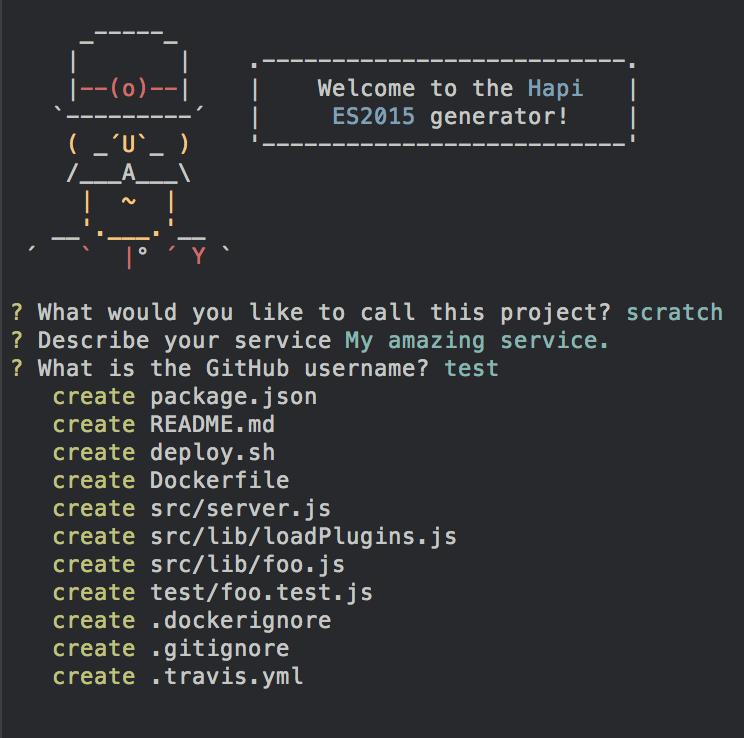

# generator-hapi-es2015

> Scaffold a hapijs micro service



## Install

```
$ npm install --global generator-hapi-es2015
```

## Usage

With [yo](https://github.com/yeoman/yo):

```
$ yo hapi-es2015
```

## Features

### Working hapijs Server

By default comes setup with the following plugins:

- `good` and `good-console` process reporting
- `hapi-swaggered` and `hapi-swaggered-ui` automatic documentation generator.
- `hapi-pkg` provides a "/healthcheck" route.

Also provides a sample route "/foobar" which returns a JSON response `{"foo": "bar"}`.

### Useful Gulp Tasks for Improved ES2015 Development

**Linting with Eslint**

Configured by default to use the "airbnb/base" eslint preset which provides 
a mostly sane set of rules for writing JavaScript, learn more [here](https://github.com/airbnb/javascript)

`$ npm run lint`

Will lint your code anytime a file changes in the `src` directory. Analyzes your code for adherence to
a [`jscs`](http://jscs.info/) code style specification. Uses the "airbnb" jscs preset.

**Tests with mocha**

`$ npm test`

Runs a test of your `src` code using mocha. Tests can be written using es2015 as well.

`$ npm run cov`

Produces an istanbul coverage report in the `coverage/` directory.

**Dev Mode**

`$ npm run tdd`

Run a file watcher to run the tests anytime a file in `src` is changed.

`$ npm run tdd:lint`

Run a file watcher which performs linting, code style checks, and tests anytime you save a file.

**Transpile to ES5 with Babel**

`$ npm run build`

Transpiles the server you've written in the `src/` directory to ES5 code and places it in the `es5/` directory. It's
possible to run your `src` files without the need for transpilation by using `babel-node` or `pm2 --next-gen-js`, but this
transpilation task is here for you if you want to use the normal `node` cli.

**Start the server**

`$ npm start`

Starts the es5 server

`$ npm start:dev`

Starts a `nodemon` file watcher on the `src/server.js` script. Anytime a file is changed in the project, the server
will automatically restart itself.
